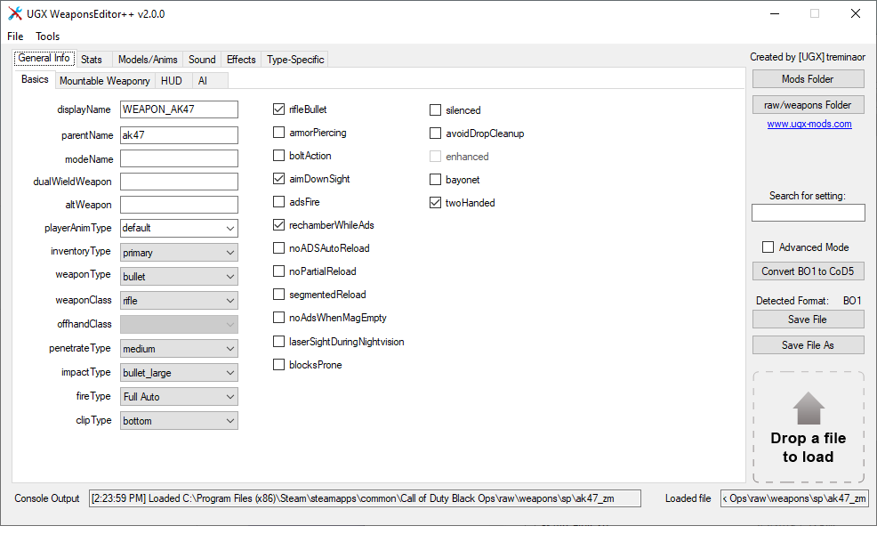

# WeaponsEditor++ v1.0.0
Full GUI frontend for creating and editing CoD-format weaponFiles

## Open Any WeaponFile
Open any weaponfile with the program, no GDTs necessary.

## Find Settings Quickly
Find any weaponfile setting within seconds using the Search for Setting feature.

## Edit Any WeaponFile Type
Edit any weaponfile type (bullet, projectile, grenade, gas, turret) without changing any program settings - it will detect what settings to display.

## Create From Existing Files
Base a new weaponfile off of an existing one by using the Save As feature and/or Advanced Mode.

## Convert BO1 to CoD5 format
Convert BO1 weaponFiles for use in CoD4/5 using the converter button on the right-side of the program.

## Helpful Tooltips
All settings have tooltips which describe what the setting does - some are taken directly from Asset Manager, others are new or rewritten to be more useful and descriptive.

## How to Use
https://confluence.ugx-mods.com/pages/viewpage.action?pageId=1146972

## Changelog
v0.8: First public release of the program. Beta Testing initiated.

v0.8.5: 
  - Fixed some settings name typos
  - Added an option to manually specify installation folder if one isn't found. 
  - Fixed a bug where the search was not jumping to certain settings
  - Added a few new tooltips for certain settings.
v0.9.0:

 - Fixed a crash that happened when editing hideTags
 - Changed the update check to run async so that the program startup was not waiting for the update check (i.e. the app starts faster now).
 
v0.9.5:
 - Added 'Advanced Mode' which allows you to edit add any setting to a weaponfile. The WaW engine sometimes allows unusual settings from one weaponClass to be used on another, even if not shown in Asset Manager. This also allows you to convert a weapon to a different weaponClass because you can add the needed additional settings.
 - Added 'Magazine' as an ammoClipType on the HUD tab.
 - Added 'rifle_grenade' as an impactType on the Basics tab.
 - Added "Are you sure?" confirmation message when trying to close the program with unsaved changes.
 - Added some user-submitted tooltips to the program.
 - Fixed some incorrectly-ordered tab indexes - you can use tab to navigate through all the settings now.
 - Added support for custom playerAnimTypes (tutorial soon)
 
v0.9.6:
 - Fixed a bug where "Advanced Mode" was not adding newly-activated settings to the outputted weaponFile.
 - Added "Convert to CoD5" button. You can convert BO1 weaponFiles to CoD5 format for direct use in the game! Now there is no excuse for lazy BO1 weapon stats porting ;)
 - Added even more tooltips (thanks to those who contributed thusfar!).
 
v0.9.7:
 - Fixed a bug which sometimes caused the first line of notetrackSoundMap to be placed out of order in the output file.
 - Added a menuStrip to the program to access all of the same functionality you can access with the buttons on the right side of the program and more.
 - Added key shortcuts for Open, Save, and Save As (see File menu for more info).
 - Added folder browse dialog in File menu for anyone who doesn't like to drag-and-drop.
 - Added a clickable list of your 5 most recently opened files in the File menu for easy access. You can also use your number keys to invoke the numbered list.
 - Added support for converting BO1 projectileWeapons correctly by removing even more BO1-only settings from them.
 - Fixed a bug where if a converted BO1 weapon had no notetrackSoundMap, Launcher might complain that the file exceeded maximum length.
 - Added an About dialog with important links and a UGX donate button.
 - Added registry repair pop-up if CoDWaW installation cannot be located.
 - Added "Are you Sure?" confirmation dialog when overwriting the opened file - there is a checkbox if you want to save your response for future, which you can reset in the Tools menu.
 - Added identifier text for what CoD version the weaponFile is recognized as (CoD4/5, BO1, N/A).
 - "Stick to ground, maintain yaw" typo fixed in Stickiness dropdown for grenadeWeapons.
 - Added "briefcase" to playerAnimType list.
 
v0.9.8:
 - Hopefully fixed the bug where the program saved "notetrackSoundMap" at the end of the hideTags, causing Launcher to complain about exceeding 8 > 8 hidetags and breaking the noterack sounds ingame.
 - Fixed possible unhandled exception when loading a weaponFile which has no hideTags line: System.ArgumentOutOfRangeException: Length cannot be less than zero.
 - Added "turret" to weaponClass list.
 
v0.9.9:
 - Yet another attempt at fixing some massively annoying bugs related to notetrackSoundMap and hideTags which caused the editor to sometimes save files which were formatted incorrectly (sorry!).
 - The program will now add files saved using Save As to the recent files list on the open menu.
 - The program will now ask you if you wish to open the new files you just saved if you used "Save As". Your choice can be saved if you check the "Do Not Ask" checbox.
 
v1.0.0:
 - Out of beta!
 - Fixed a bug where adsZoomFOV was not grabbed while doing BO1 weaponFile conversions. By default the program will now take adsZoomFov2 as the value for WaW's adsZoomFov. This will work fine for non-variable-zoom weapons, and variable-zoom weapons will import the middle zoom FOV.
 - Fixed a bug where entering a custom value to "playerAnimType" would not be saved to the weaponFile.
 - Added the name of the last edited setting to the "You have unsaved changes!" warning screen so that you know why you are seeing the message.
 - You can now drop files anywhere on the program instead of just in the drop zone.
 - You can now open a new instance of the program using the File menu.
 - You can now open the current file to a new instance of the program by using the File menu.
 - You can now open a weaponFile by dragging it onto the WeaponsEditor++.exe itself.
